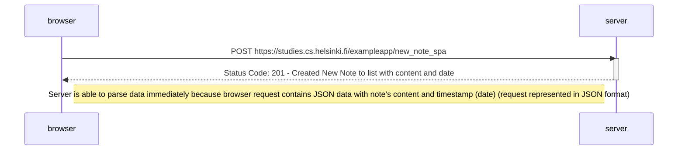

```mermaid  
sequenceDiagram
    participant browser
    participant server
    
    browser->>server: POST https://studies.cs.helsinki.fi/exampleapp/new_note_spa   
    activate server  
    server-->>browser: Status Code: 201 - Created New Note to list with content and date
    deactivate server
    Note right of browser: Server is able to parse data immediately because browser request contains JSON data with note's content and timestamp (date) (request represented in JSON format)

```